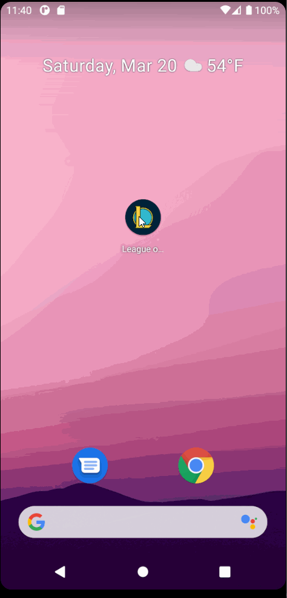

# League-of-League-Tracker

## DEMO

## 1. User Stories (Required and Optional)

**Required Must-have Stories**

 * [x] User can search stats by summoner name
 * [x] User can view recent match history 
 * [x] User can also see current ranking and average KDA
 * [x] User can click/tap on a match for more info

**Optional Nice-to-have Stories**

 * [ ] Infinite pagination for match history - recent 10 can be continually expanded to more matches
 * [ ] Favorites/Recent searches listed on screen for convenience

## 2. Screen Archetypes

 * Summoner Search screen (Login)
   * Input bar for user to specify the summoner to get stats for
   * Favourites/Recent searches bar
 * Summoner Stats screen (Stream/Feed)
   * List of recent matches with small amount of important stats on view
   * Ranking (Tier and LP) details and average KDA for displayed matches listed near top of screen
   * Should be able to click on match to get more detail (implementation tbd) 
 * Match detail screen / Dropdown? (TBD) 

## 3. Navigation

**Tab Navigation** (Tab to Screen)

 * Summoner search screen
 * ...

**Flow Navigation** (Screen to Screen)

 * Login/Summoner Search screen
   * User inputs summoner name in search bar (or as much as they remember)
   * User clicks on summoner they want to view details/stats for from results
   * Stretch - user can use a box of 'favorite/starred' summoners for quick access
 * Feed/Summoner Stats screen
   * User can scroll up and down a list of recent match summaries
   * User can click on a match for more details (deciding whether to expand details on same screen or navigate to Detail/Match Detail screen tbd)

## 4. Wireframes

## 5. Schema

### Models

#### Summoner
Name        | Type      | Description
----------- | :-------: | -----------
name        | Sring     | Summoner name
summonerID  | String    | Encrypted summoner ID
accountID   | String    | Encrypted account ID
iconID      | int       | profile icon ID
level       | int       | summoner account level
    - Note: encrypted values are encrypted using api key, thus are unique per api key

#### Mastery
Name            | Type  | Description
--------------- | :---: | -----------
championID      | int   | Champion ID
masteryLevel    | int   | Mastery Level for a champion
masteryPoints   | int   | Mastery Points for a champion

#### League
Name           | Type          | Description
-------------- | :-----------: | -----------
queue          | String        | SoloQueue, Flex
tier           | String        | Iron, Bronze, Silver, Gold, etc.
rank           | String        | rank I, II, III, IV within tier
lp             | int           | 'League Points' progression towards next rank/tier
wins           | int           | total ranked wins
losses         | int           | total ranked losses
hotStreak      | boolean       | 3+ wins in a row
miniSeries     | MiniSeries    | series if summoner is in promos

#### MiniSeries
Name       | Type      | Description
---------- | :-------: | -----------
losses     | int       | number of losses
wins       | int       | number of wins
target     | int       | required wins to promote
progress   | String    | W,L,N representation of serie

#### MatchSummary
Name          | Type             | Description
------------- | :--------------: | -----------
gameID        | long             | game ID unique to match
timestamp     | long             | Date of match (in UnixEpochMilliseconds)
gameDuration  | long             | match duration in seconds
win           | boolean          | whether or not the match was won
champion      | int              | (same as championID)
queueID       | int              | type of queue/map (e.g. ranked, draft, aram) 
userIndex     | int              | for quick access to user's [participant] info
participants  | list[particpant] | list of match participants

#### participant
Name          | Type                  | Description
------------- | :-------------------: | -----------
name          | String                | summonerName
ID            | int                   | participant ID
champion      | int                   | (same as championID)
team          | int                   | 100 for blue, 200 for red side
spell1        | int                   | first summoner spell ID
spell2        | int                   | second summoner spell ID
icon          | int                   | profile icon ID (same as iconID)
stats         | participantStats      | participant stats for current match

#### participantStats
Name                | Type                  | Description
-------------       | :-------------------: | -----------
item[0-6]           | int[]                 | itemID (resolved to item name/icon with db)
runes[0-5]          | int[]                 | chosen runes by ID (0-3 primary, 4-5 secondary)
runeShards[0-2]     | int[]                 | chosen rune shards by ID (off, flex, def)
runePrimary         | int                   | rune path for primary keystone ID
runeSecondary       | int                   | rune path for secondary keystone ID
level               | int                   | champion level
kills               | int                   | champion kills
deaths              | int                   | champion deaths
assists             | int                   | champion assists
CS                  | int                   | CS score (total minions killed)
visionScore         | int                   | vision score (calculated by riot)
visionWards         | int                   | control wards bought
wardsPlaced         | int                   | total wards placed
wardsKilled         | int                   | total wards killed
goldEarned          | int                   | gold earned
totalDamageDealt    | long                  | total damage dealt

### Networking

#### List of network requests by screen
- Home/Search Screen
  - GET: request summoner info by name after user inputs name
- Feed Screen
  - GET: request champion mastery info to list top 3 (if not already cached) 
  - GET: request league info to display ranking(s)
  - GET: request match list info
  - GET: subsequent requests for match details on first 5 matches (for matches not already cached)

### Existing API Endpoints
Base Url: [https://na1.api.riotgames.com](https://na1.api.riotgames.com)
HTTP Verb   | Endpoint  | Description
----------- | --------- | -----------
'GET'       | /lol/summoner/v4/summoners/by-name/{summonerName} | Returns summoner IDs. Needed for other calls
'GET'       | /lol/match/v4/matchlists/by-account/{encryptedAccountID} | Returns brief summary of 100 matches
'GET'       | /lol/match/v4/matches/{matchID}   | Returns details of a particular match
'GET'       | /lol/champion-mastery/v4/champion-masteries/by-summoner/{encryptedSummonerID} | Return champion mastery data
'GET'       | /lol/league/v4/entries/by-summoner/{encryptedAccountID}   | Returns JSONList of league info (ranking)